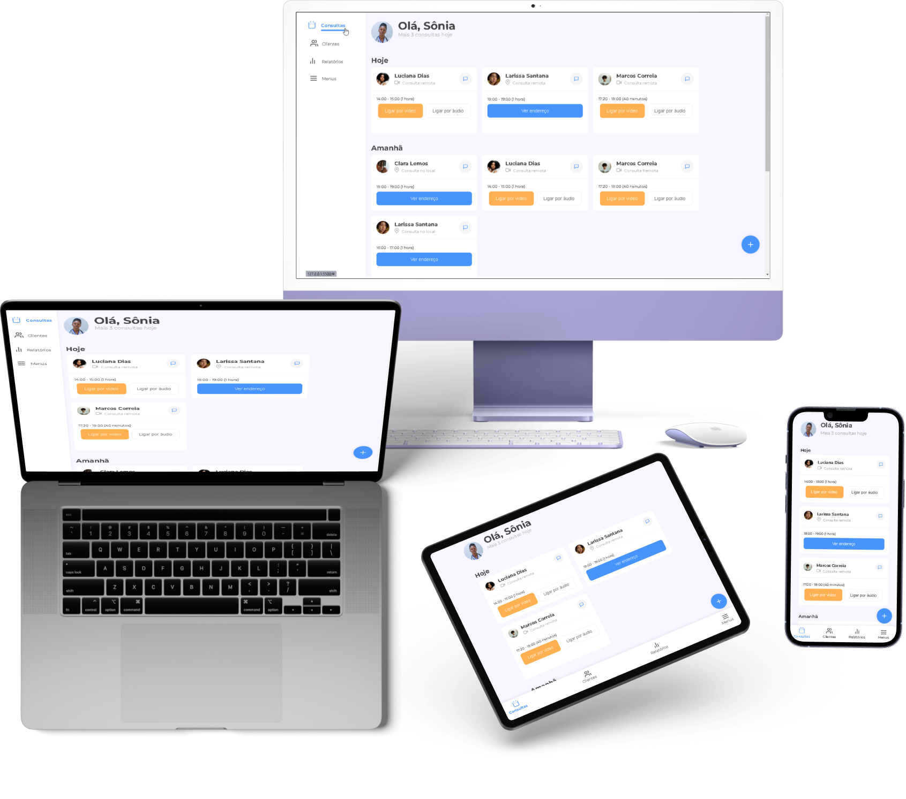

# Desafio de Responsividade Alura

## Sobre o projeto

Este projeto foi criado para cumprir um desafio proposto por **Alura** sobre responsividade para **Web Frontend**.

O objetivo foi criar uma interface gráfica de um aplicativo de agenda e acompanhamento de consultas de pacientes para **médicos**, usando apenas **HTML** e **SCSS**, englobando muitos conceitos de responsividade e boas práticas como:

- HTML semântico;
- Arquitetura simples de partials usando SCSS;
- Posicionamento de elementos com Grid e FlexBox;
- Tipografia e imagens fluidas;
- Responsividade.

## Layout do Projeto

<figure>
  
  <figcaption>Imagens do site em diferentes dispositivos</figcaption>
</figure>

## Tecnologias utilizadas

- HTML
- SCSS
- BEM
- Figma
- Fontes do Google

## Autor

**Juan Galdino da Costa e Silva**

Linkedin: <https://www.linkedin.com/in/juan-galdino-da-costa-e-silva/>

E-mail: <jgaldino.cs@gmail.com>

Link do deploy: <https://juan-galdino.github.io/responsividade_alura_desafio/>
